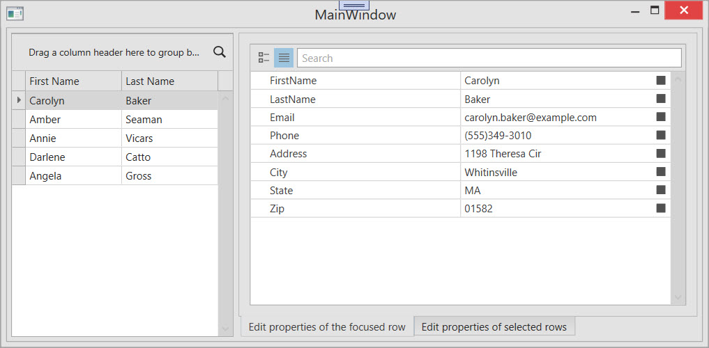

<!-- default badges list -->

[](https://supportcenter.devexpress.com/ticket/details/T324511)
[](https://docs.devexpress.com/GeneralInformation/403183)
[](#does-this-example-address-your-development-requirementsobjectives)
<!-- default badges end -->

# WPF Property Grid - Inspect and Edit Object Properties

This example uses the WPF [`PropertyGridControl`](https://docs.devexpress.com/WPF/DevExpress.Xpf.PropertyGrid.PropertyGridControl) to inspect and modify properties of data objects displayed in the [`GridControl`](https://docs.devexpress.com/WPF/DevExpress.Xpf.Grid.GridControl). Use the `PropertyGridControl` to create object inspectors inspired by the `Properties` window in the Visual Studio IDE.



## Implementation Details

### Source Object

The `Contact` class declares public bindable properties. The `PropertyGridControl` inspects the object's public properties and allows users to browse and modify them. The `Contact` class implements property change notifications. Updates made in the `PropertyGridControl` are applied immediately to the source object and reflected in the `GridControl`. 

```csharp
public class Contact : BindableBase {
    string _FirstName;
    public string FirstName {
        get { return _FirstName; }
        set {
            _FirstName = value;
            RaisePropertyChanged(() => FirstName);
        }
    }
    // ...
}
```

### Data Source

The `ViewModel` exposes a typed collection of contacts.

```csharp
public class ViewModel {
    public List<Contact> Items { get; set; }
    public ViewModel() {
        Items = new List<Contact> {
            new Contact() {
                FirstName = "Carolyn",
                LastName = "Baker",
                Email = "carolyn.baker@example.com", 
                Phone = "(555)349-3010",
                Address = "1198 Theresa Cir", 
                City = "Whitinsville", 
                State = "MA", 
                Zip = "01582"
            }, 
            // ...
        };
    }
}
```

### Property Grid Configuration

This example creates two Property Grid controls and displays them in tab containers. The first Property Grid control inspects the `Contact` object that corresponds to the focused item in the `GridControl`. The second Property Grid control inspects `Contact` objects that correspond to selected items in the `GridControl`:

```xaml
<dx:DXTabControl>
    <dx:DXTabItem Header="Edit properties of the focused row">
        <dxprg:PropertyGridControl SelectedObject="{Binding Path=CurrentItem, ElementName=grid}" ShowCategories="False"/>
    </dx:DXTabItem>
    <dx:DXTabItem Header="Edit properties of selected rows">
        <dxprg:PropertyGridControl SelectedObjects="{Binding Path=SelectedItems, ElementName=grid}" ShowCategories="False"/>
    </dx:DXTabItem>    
    
    ...

</dx:DXTabControl>
```

When a user selects a contact, the `PropertyGridControl` displays its properties. The user can edit each property value directly in the grid.

## Files to Review

* [MainWindow.xaml](./CS/MainWindow.xaml) (VB: [MainWindow.xaml](./VB/MainWindow.xaml))
* [MainWindow.xaml.cs](./CS/MainWindow.xaml.cs) (VB: [MainWindow.xaml.vb](./VB/MainWindow.xaml.vb))
* [Data.cs](./CS/Data.cs) (VB: [Data.vb](./VB/Data.vb))

## Documentation

* [GridControl](https://docs.devexpress.com/WPF/DevExpress.Xpf.Grid.GridControl)
* [PropertyGridControl](https://docs.devexpress.com/WPF/DevExpress.Xpf.PropertyGrid.PropertyGridControl)
* [PropertyGridControl.SelectedObject](https://documentation.devexpress.com/#WPF/DevExpressXpfPropertyGridPropertyGridControl_SelectedObjecttopic)
* [DXTabControl](https://docs.devexpress.com/WPF/7975/controls-and-libraries/layout-management/tab-control/fundamentals/dxtabcontrol)

## More Examples

* [WPF Data Grid – Bind to Dynamic Data](https://github.com/DevExpress-Examples/wpf-bind-gridcontrol-to-dynamic-data)
* [WPF Data Grid – Handle Drag and Drop Operations](https://github.com/DevExpress-Examples/wpf-grid-handle-drag-and-drop)
* [WPF Data Grid – Specify Custom Content for Column Chooser Headers](https://github.com/DevExpress-Examples/wpf-data-grid-custom-content-for-column-chooser-headers)

<!-- feedback -->
## Does this example address your development requirements/objectives?

[](https://www.devexpress.com/support/examples/survey.xml?utm_source=github&utm_campaign=wpf-property-grid-display-object-properties&~~~was_helpful=yes) [](https://www.devexpress.com/support/examples/survey.xml?utm_source=github&utm_campaign=wpf-property-grid-display-object-properties&~~~was_helpful=no)

(you will be redirected to DevExpress.com to submit your response)
<!-- feedback end -->
